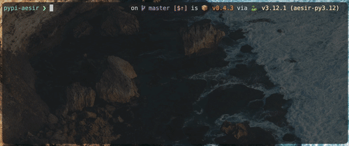

# Aesir

[](https://twentyone.world)
[](https://mempool.space/lightning)
[](https://podman.io)
[](https://github.com/krutt/aesir/blob/master/LICENSE)
[](https://github.com/krutt/aesir)
[](https://github.com/krutt/aesir)
[](https://github.com/krutt/aesir)
[](https://github.com/krutt/aesir)

[](static/aesir-banner.svg)

## Prerequisites

* python (3.9+)
* pip
* podman

## Getting started

You can use `aesir` simply by installing via `pip` on your Terminal.

```sh
pip install aesir
```

And then you can begin deploying local cluster as such:

```sh
aesir deploy
```

The initial deployment may take some time at pulling required images from their respective
repositories. Results may look as such:

```sh
$ pip install aesir
> ...
> Installing collected packages: aesir
> Successfully installed aesir-0.4.3
$ aesir deploy
> Deploy specified local cluster:            ━━━━━━━━━━━━━━━━━━━━━━━━━━━━━━━━━━━━━━━━ 100% 0:00:01
> Generate addresses:                        ━━━━━━━━━━━━━━━━━━━━━━━━━━━━━━━━━━━━━━━━ 100% 0:00:00
> Mine initial capital for parties:          ━━━━━━━━━━━━━━━━━━━━━━━━━━━━━━━━━━━━━━━━ 100% 0:00:00
```

You will have podman containers running in the backend, ready to be interfaced by your local
environment applications you are developing.

## Begin local mining

In order to properly test many functionalities, you will need to send mining commands to local
setup. You can achieve completely local and running environment with the following command:

[](https://github.com/krutt/aesir/blob/master/static/demo.gif)

### Cluster types

Currently there are two supported cluster-types in this project. Specified by flags,
`--duo` (default), or `--cat`, `--ohm`, `--uno` with the following set-up:

| Type | Description                                                                |
| ---- | -------------------------------------------------------------------------- |
|  cat | Customized `aesir-bitcoind-cat` node that has OP_CAT enabled for experiments |
|  duo | Contains two LND nodes named `aesir-ping` and `aesir-pong` unified by <br> one single `aesir-bitcoind` service. |
|  ohm | Only has `aesir-bitcoind` without any Lightning nodes. |
|  uno | Only has one LND node named `aesir-lnd` connected to `aesir-bitcoind`. |

### Peripheral containers

This project also helps you setup peripheral services to make development process easier, too.
For example, if you want to deploy a duo-cluster with attached postgres database, run the following:

```sh
$ aesir deploy --with-postgres
> ...
$ aesir mine
> ╭───── containers ─────╮┏━━━━━━━━━━━━━━━┳━━━━━━━━━━━━━━┳━━━━━━━━━━━┳━━━━━━━━┳━━━━━━━━┳━━━━━━━━━┓
> │ aesir-postgres       │┃ Name          ┃ Nodekey      ┃ Channels  ┃ Peers  ┃ Height ┃ Synced? ┃
> │ aesir-pong           │┡━━━━━━━━━━━━━━━╇━━━━━━━━━━━━━━╇━━━━━━━━━━━╇━━━━━━━━╇━━━━━━━━╇━━━━━━━━━┩
> │ aesir-ping           ││ aesir-pong    │ 3da33d3eb12  │ 2         │ 1      │ 216    │    true │
> │ aesir-bitcoind       ││               │ deacf4e1a64  │           │        │        │         │
> │ ...                  ││ ...           │ ...          │ ...       │ ...    │ ...    │ ...     │
```

Or run an uno-cluster with both attached postgres database and redis solid store cache like this:

```sh
$ aesir deploy --uno --with-postgres --with-redis
> ...
$ aesir mine
> ╭───── containers ─────╮┏━━━━━━━━━━━━━━━┳━━━━━━━━━━━━━━┳━━━━━━━━━━━┳━━━━━━━━┳━━━━━━━━┳━━━━━━━━━┓
> │ aesir-postgres       │┃ Name          ┃ Nodekey      ┃ Channels  ┃ Peers  ┃ Height ┃ Synced? ┃
> │ aesir-redis          │┡━━━━━━━━━━━━━━━╇━━━━━━━━━━━━━━╇━━━━━━━━━━━╇━━━━━━━━╇━━━━━━━━╇━━━━━━━━━┩
> │ aesir-lnd            ││ aesir-lnd     │ c0ae6b158d0  │ 0         │ 0      │ 202    │    true │
> │ aesir-bitcoind       ││               │ 4194459b8f3  │           │        │        │         │
> │ ...                  ││ ...           │ ...          │ ...       │ ...    │ ...    │ ...     │
```

## Cleanup

Use the following command to clean up active `aesir-*` containers:

```sh
aesir clean
```

🚧  This will resets the current test state, so use with care. Example below:

```sh
$ aesir clean
> Remove active containers:                  ━━━━━━━━━━━━━━━━━━━━━━━━━━━━━━━━━━━━━━━━ 100% 0:00:01
```

## Change-logs

* **0.3.1** Add `aesir-cashu-mint` & `aesir-lnd-krub` image setups and deployments w/ shared volumes
* **0.3.2** Define classifiers on `pyproject.toml` for PyPI metadata
* **0.3.3** Drop `black` and use [ruff](https://github.com/astral-sh/ruff) formatter and linter
* **0.3.4** Simplify deployment workflows and 
* **0.3.5** Restructure project so that when installed, `src` folder will not be created
* **0.3.6** Breakdown "setup" command into "build" and "pull"
* **0.3.7** Lightning cluster now with [ord](https://github.com/ordinals/ord)
* **0.3.8** Rename "ord" to "ord-server" to avoid confusion with cli
* **0.3.9** Remove intermediate containers
* **0.4.0** Resist electricity with "ohm" mode
* **0.4.1** Remove Ordinals' spiked ball
* **0.4.2** Disable bitcoind prune mode
* **0.4.3** Implement dashboard walkthrough using [blessed](https://github.com/chj/blessed)
* **0.4.4** Add `cat` cluster in deployment and `--bitcoind-cat` flag for customized build
* **0.4.5** The Yggdrasil update where docker build logs are chunked for display
* **0.4.6** Create default wallet if no lnd containers
* **0.4.7** (reverted) Remove unittesting from image build process
* **0.4.8** Follow [Productivity Notes](https://github.com/bitcoin/bitcoin/blob/master/doc/productivity.md) for `bitcoind-cat`; Fix progress bar overlap.
* **0.4.9** Change package manager and add `invoice` command
* **0.5.0** Adopt podman to encourage daemonlessness and rootlessness

## Roadmap

* Simplify `schemas.yml` and embed commands to service definitions
* Drop `docker-py` and replace with `podman-py`
* Write [click](https://click.palletsprojects.com) tests.
* Add `aesir-tesla-ball` peripheral service using [tesla-ball](https://github.com/krutt/tesla-ball)
* Use [joblib](https://github.com/joblib/joblib) to speed up deployment with parallelization.
* Create and add some type of `ordapi` peripheral service.

## Contributions

### Prerequisites

* [pyenv](https://github.com/pyenv/pyenv) - simple Python version management
* [uv](https://docs.astral.sh/uv) - extremely fast Python package & project manager written in Rust

### Set up local environment

The following guide walks through setting up your local working environment using `pyenv`
as Python version manager and `uv` as Python package manager. If you do not have `pyenv`
installed, run the following command.

<details>
  <summary> Install using Homebrew (Darwin) </summary>
  
  ```sh
  brew install pyenv --head
  ```
</details>

<details>
  <summary> Install using standalone installer (Darwin and Linux) </summary>
  
  ```sh
  curl https://pyenv.run | bash
  ```
</details>

If you do not have `uv` installed, run the following command.

<details>
  <summary> Install using Homebrew (Darwin) </summary>

  ```sh
  brew install uv
  ```
</details>

<details>
  <summary> Install using standalone installer (Darwin and Linux) </summary>

  ```sh
  curl -LsSf https://astral.sh/uv/install.sh | sh
  ```
</details>


Once you have `pyenv` Python version manager installed, you can
install any version of Python above version 3.9 for this project.
The following commands help you set up and activate a Python virtual
environment where `uv` can download project dependencies from the `PyPI`
open-sourced registry defined under `pyproject.toml` file.

<details>
  <summary> Set up environment and synchroniz project dependencies </summary>

  ```sh
  pyenv shell 3.11.9
  uv venv  --python-preference system
  source .venv/bin/activate
  uv sync --dev
  ```
</details>

## License

This project is licensed under the terms of the MIT license.
